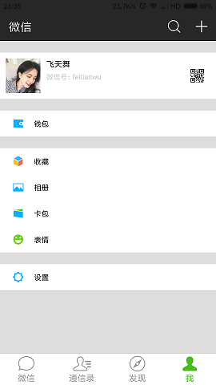
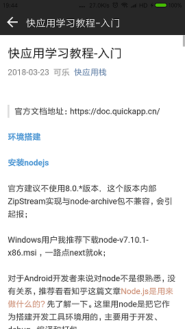

# 快应用实现的微信Demo

> 欢迎大家一起学习快应用开发

## 目前进度

- [x] 基本UI
- [ ] 详细功能

## [入门教程](https://juejin.im/post/5ab4d4c36fb9a028b92d149c) 

## 快应用开发中发现的问题：

### CSS问题

- 默认是flex布局，css就不用显示设置了；
- 一定要看文档提示，有些属性不支持，比如 `justify-content` 不支持 `space-around`

### 布局问题

- 自定义布局导入到父布局后默认宽高还是屏幕尺寸，并不是限制到父布局宽高

### 事件

- 没有touch事件

### DOM

- 不能操作document，比如所document.getElementById
- onReady后才能操作DOM
- $element(id) 不能直接修改style

### MVVM

- VM的属性值必须在onInit之前修改好，等onReady后再修改无效，view不能更新

## 欢迎大家关注`快应用栈`公众号

