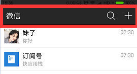
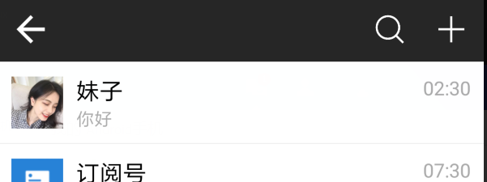
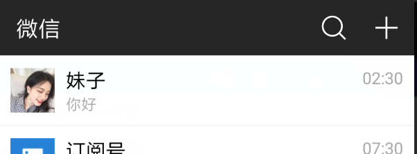
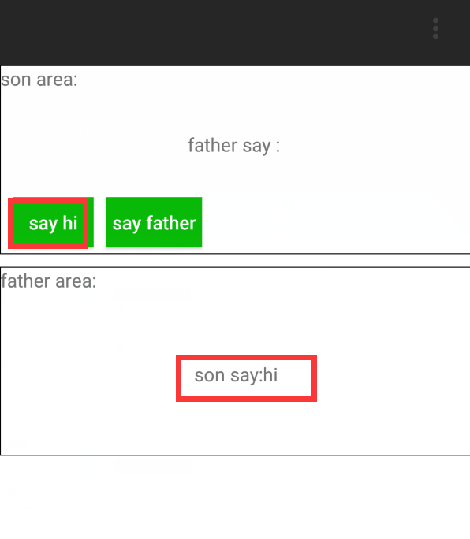
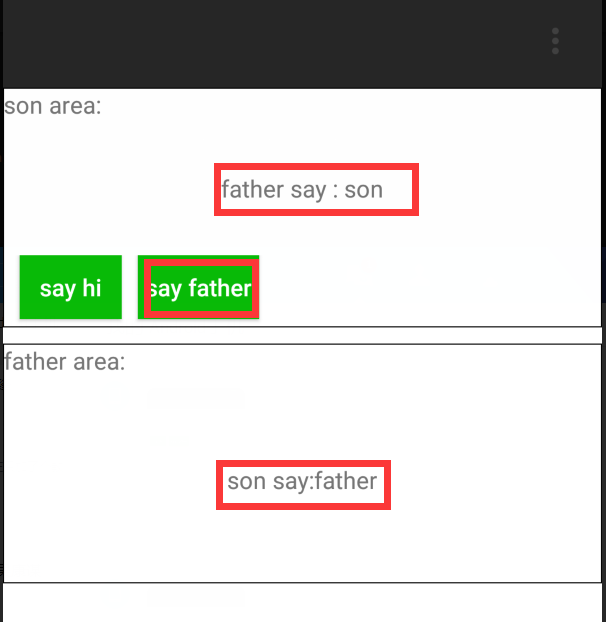
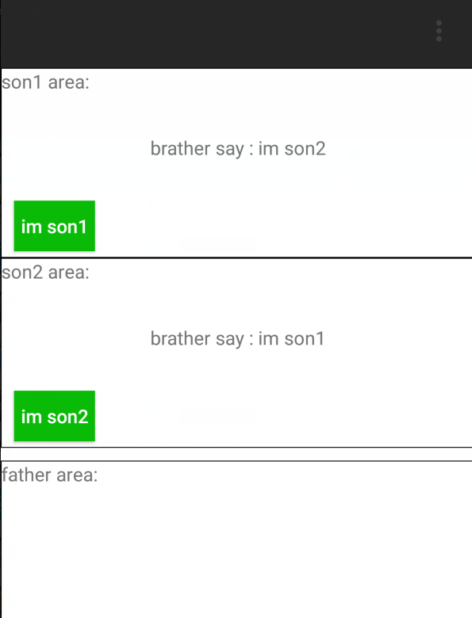

# 快应用教程-实现自定义组件

 以下用到的代码例子都在这里[快应用实现的微信Demo](https://github.com/yale8848/quickapp-wechat):

```
git clone https://github.com/yale8848/quickapp-wechat
cd quickapp-wechat
git checkout v0.1.1

```

## 为什么用自定义组件

  自定义组件首先是一个组件，至少包含一个.ux文件，文件里把组件要实现的UI，逻辑封装起来共外界调用，这样可以让组件之间解耦，组件功能更加单一、灵活；举个微信Demo中的一个例子，我要实现微信的titlebar功能，

  

  当然我可以用系统的titlebar，但是为了功能更丰富，我把它作为一个组件来实现，下面来看看实现自定义组件的过程。

### 创建ux文件
   
   如微信Demo里的Title/index.ux,创建好`<template>`,`<style>`,`<script>`，根据需求titlebar有3个按钮，一个标题：

   ```
<template>
        <div id="title">
            <div class="left">
                    <image id="back" src="/Common/Image/back.png"  onclick="back()"></image>
                    <text id="name" >{{text}}</text>
            </div>

                <div class="actions">
                        <div class="search"></div>
                        <div class="plus"></div>
                </div>
            </div>
    </template>
<style>
    #title {
        background-color: #272727;
        height: 100px;
        align-items: center;
        justify-content: space-between
    }
    
    #title #name {
        font-size: 40px;
        margin-left: 30px;
        color: #FFFFFF;
        lines: 1
    }
    
    #title #back {
        width: 50px;
        height: 50px;
        margin-left: 25px;
    }
    
    #title>.actions {
        height: 100%;
        align-items: center;
        margin-right: 30px;
    }
    
    .search {
        width: 50px;
        height: 50px;
        background-image: url(/Common/Image/search.png);
        margin-right: 50px;
    }
    
    .plus {
        width: 40px;
        height: 40px;
        background-image: url(/Common/Image/plus.png);
    }
</style>

<script>
    export default {
        back() {
            router.back()
        }
    }
</script>

   ```
好了，上面ux文件已经把titlebar的UI创建好了，还有一个返回事件也添加了；

### 如何调用组件

   使用improt标签，name是自定义名称，详细看Demo里的Main/index.ux

   ```
<import name="comp-title" src="../Title"></import>

<template>
<div>
<comp-title></comp-title>
</div>
</template>
   ```

这样就可以把title调用起来了

```
npm run watch
npm run server
```

看看效果：



等等，怎么不见标题了？嗯，咱还没有设置呢，可能不同页面对标题、返回按钮是否显示的要求不一样，那么我们就要能动态控制；

### 给子组件传值

- 子组件用`props`属性暴露变量给父组件调用，如下暴露`['showBack', 'showText', 'showPlus', 'showSearch', 'text']`变量，它们分别是控制返回按钮、标题、加按钮、搜索按钮是否显示以及标题内容,然后把这些变量绑定到UI控件上

```
<script>
    import router from '@system.router'
    export default {
        props: ['showBack', 'showText', 'showPlus', 'showSearch', 'text'],
        data: {},
        onInit() {},
        back() {
            router.back()
        }
    }
</script>

<template>
        <div id="title">
            <div class="left">
                    <image id="back" src="/Common/Image/back.png" show="{{showBack}}" onclick="back()"></image>
                    <text id="name"  show="{{showText}}">{{text}}</text>
            </div>

                <div class="actions">
                        <div class="search" show="{{showSearch}}"></div>
                        <div class="plus" show="{{showPlus}}"></div>
                </div>
            </div>
    </template>

```

- 父组件调用

通过给子组件标签设置属性值来调用子组件变量，`子组件变量用驼峰命名方式，父组件调用子组件属性命名用-来分隔驼峰`

```

<import name="comp-title" src="../Title"></import>
<template>
<div>
<comp-title show-back="false" show-text="true" show-plus="true" show-search="true" text="微信"></comp-title>
</div>
</template>
```
调用结果如下：




### 父子组件通信

    除过上面父组件给子组件以变量的形式传值外，父子之间可以以消息的形式传值：

#### 父给子发消息

    以下代码见src/Demo/comm 
    
    子组件订阅fatherSay消息：

    ```
        data: {
            say: ""
        },
        sayMsg(evt) {

            this.say = evt.detail.msg //收到消息

        },
        onInit() {
            this.$on("fatherSay", this.sayMsg) //订阅消息
        },
    ```

    父组件给fatherSay发消息：

    
    ```
    this.$broadcast('fatherSay', {
                    msg: "son"
    })
    ```

#### 子组件给父组件发消息

   父组件有2种方式订阅子组件消息：

   - 父组件以js代码形式订阅，子组件以$dispath发送事件

```
     onInit() {
        this.$on("sonSay", this.sayMsg)
    }
```

```
    this.$dispath('sonSay', {
        msg: t
    })
```

   - 父组件以子组件标签属性形式订阅,子组件以$emit发送事件


    ```
        <son @son-say="sayMsg"></son>

    ```

    ```
    this.$emit('sonSay', {
                msg: t
        })
    ```
  
  大家可以把manifest.json 中的entry改为`"entry": "Demo/comm"`,看看效果：

  


  当点击子组件say hi时父组件会收到子组件消息；


  


  当点击子组件say father时父组件会收到子组件消息并反馈给子组件"son"的消息


### 兄弟组件之间发消息

以下代码在src/Demo/comm2中

兄弟组件之间发消息之前要先通过父组件互相绑定VM对象：

```
    onReady() { //注意要放在onReady调用
            const vm1 = this.$vm('son1')
            const vm2 = this.$vm('son2')

            vm1.parentVm = this
            vm1.nextVm = vm2
            vm2.parentVm = this
            vm2.previousVm = vm1
        }

```

然后兄弟组件之间发消息有两种形式：

- 通过VM对象调用对方函数：

``` 
    //son2.ux
    brotherSay(msg) {
        this.say = msg
    },
```

```
    //son1.ux
    if (this.nextVm) {
        this.nextVm.brotherSay(msg)
    }
```
- 通过event事件：

```
   //son1 绑定消息
    events: {
            eventSay(evt) {
                this.say = evt.detail
            }
    }
```

```
  //son2 通过$emit发送消息
  if (this.previousVm) {
                
        this.previousVm.$emit('eventSay', msg)
    }

```

 大家可以把manifest.json 中的entry改为`"entry": "Demo/comm2"`,看看效果：




 以上用到的代码例子都在这里[快应用实现的微信Demo](https://github.com/yale8848/quickapp-wechat):
```
git clone https://github.com/yale8848/quickapp-wechat
cd quickapp-wechat
git checkout v0.1.1

```

## 欢迎大家关注`快应用栈`公众号

