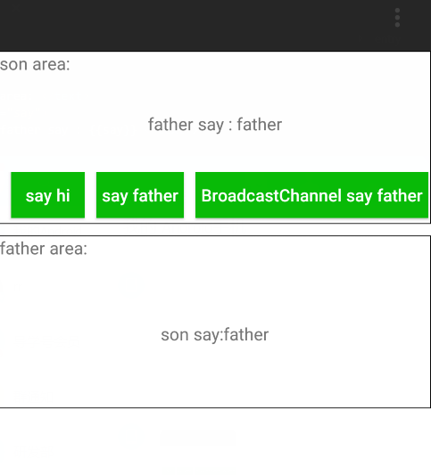

# 快应用中的‘EventBus’

> 前边一片文章 `快应用教程-实现自定义组件` 已经讲过如何自定义组件和组件之间通信，今天要讲的BroadcastChannel不同于前面的方式，BroadcastChannel可以让通信彻底解耦，不同页面、组件之间都可以用。BroadcastChannel就像是Android界的EventBus。

 以下用到的代码例子都在这里[快应用实现的微信Demo](https://github.com/yale8848/quickapp-wechat):

```
git clone https://github.com/yale8848/quickapp-wechat
cd quickapp-wechat
git checkout v0.1.1

```

BroadcastChannel就是一种订阅发布组件，发布者给某一事件发送消息，所有订阅相同事件的订阅者会收到同一个消息；

## 订阅事件

订阅'说话'事件

```
    onInit() {
        this.sayEvent = new BroadcastChannel('say')
           
        this.sayEvent.onmessage = function (event) {
                
        }
        }
```

## 发布事件

发布'说话'事件，注意，`自己不会收到自己发的消息`

```
   this.sayEvent = new BroadcastChannel('say');
   this.sayEvent.postMessage('')

```

## 关闭事件

当当前页面销毁的时候记得要关闭事件

```
onDestroy(){
    this.sayEvent.close()
}
```

大家可以把manifest.json 中的entry改为`"entry": "Demo/comm"`试一试




## 欢迎大家关注`快应用栈`公众号

